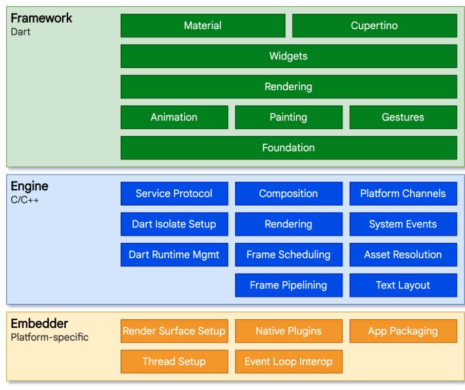
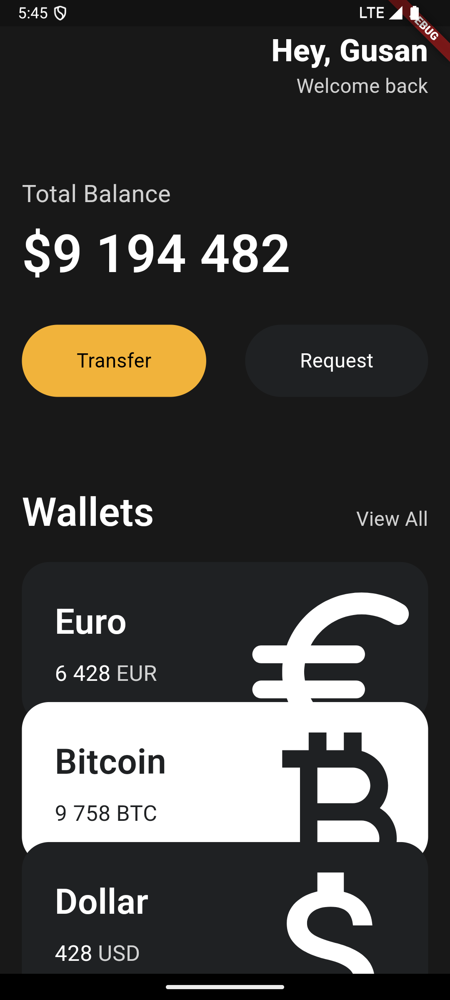
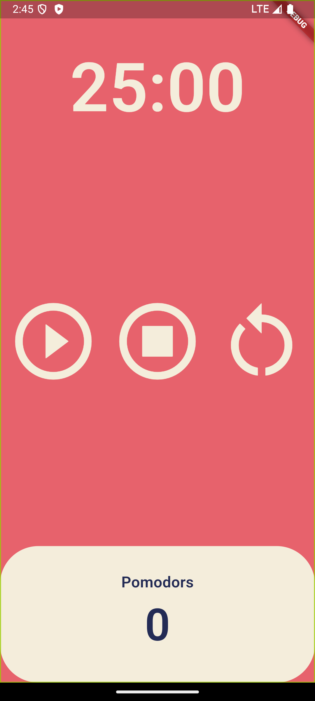
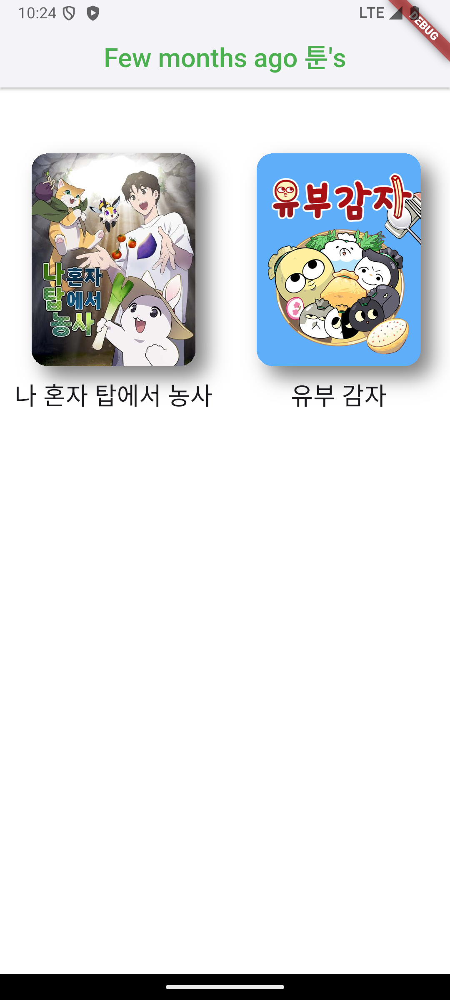
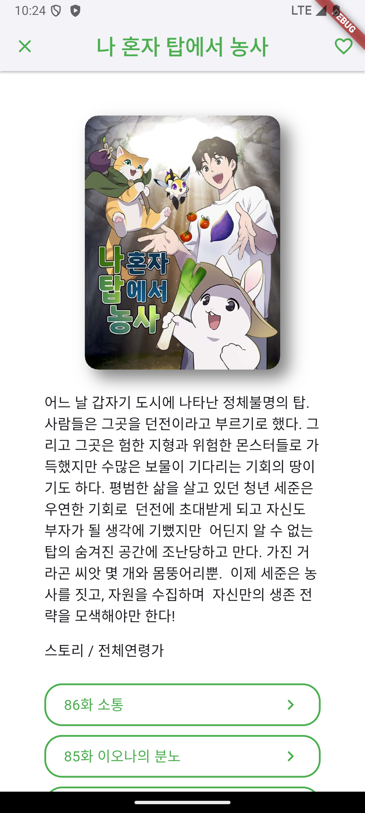
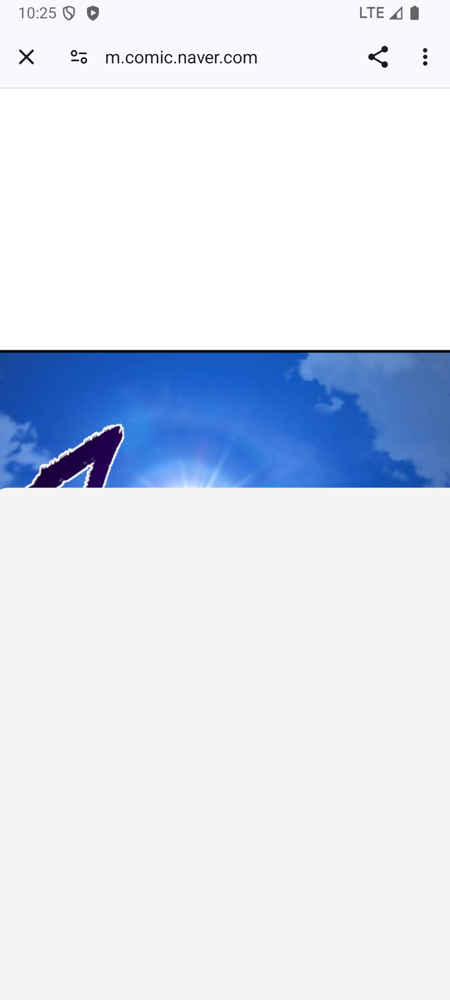

# Flutter

-   크로스 플랫폼.

1. 다른 Framework들은 OS를 통하여 버튼이나 근사한 애니메이션 등의 모든 요소를 만들어달라고 요청하는 직접적인 소통을 하는 반면, Flutter는 C나 C++로 짜인 **엔진**을 통하여 Framework를 동작시키고 UI를 그려낸다. (직접적 소통이 아니라서 OS에 대한 어떠한 제약 사항이 없다.)
2. 안드로이드, 윈도우 등의 플렛폼이 엔진을 동작하면 엔진은 "runner"프로젝트를 열어 엔진을 실행시키고 우리가 짠 Dart Flutter 코드를 동작시켜 화면에 UI를 보여준다.
3. Flutter : 엔진을 어플리케이션 내부에 집어넣기 -> 우리가 짠 Dart 코드 컴파일하기
4. 유저가 어플리케이션을 실행시킬 때 엔진을 가동시키는 "runner"프로젝트를 실행시킨 후, 엔진이 모든 UI를 Framework와 함께 그려준다.
5. Embedder(= "runner"프로젝트) : 특정 플렛폼에 특화된 것
6. iOS, 안드로이드, 맥OS, 윈도우, 리눅스를 위한 다양한 Embedder이 존재한다.
7. Embedder의 역할: 엔진 가동시키기

-   엔진을 또다른 VM(가상��신)이라고 생각해도 된다. 가상머신이 코드를 실행시키기 때문에 OS 에 구애받지 않고 코드를 실행시켜준다.



---

React Native👍  
네이티브 앱 운영체제 상에서 가능한 위젯을 사용해야 하는 경우
디자인이 iOS 혹은 Android 앱처럼 보이게끔 만들고 싶은 경우

Flutter👍  
세밀한 디자인 요구사항이 있거나 100% 커스터마이징하고 싶은 경우
외부 패키지에 의존하지 않고 고수준의 애니메이션을 구현하고 싶은 경우

---

# Wallet 정적 프로젝트 (Stateless)
- main_wallet.dart / widgets_wallet folder 참고  



# Pomodors 동적 프로젝트 (Statefull)
- main_pomodors.dart / home_screen.dart 참고  



# webtoon 링크 프로젝트 (Statefull / Stateless)
- main.dart / models / screens / services / widget 확인

- 웹툰 이미지의 경우 저작권 문제가 있을 수 있기 때문에 일부 masking 처리 

<div style="display: inline-block; margin-right: 10px;">
  
  
  
</div>

## Flutter 프로젝트 생성

- vscode 로 실행키기기 위해서는 시뮬래이터, 또는 웹 페이지를 개별로 실행시켜야한다. (debug 모드)
- 웹에서도 모바일 앱을 만들 수 있으며 크로스 플랫폼의 특징을 가지고 있다.

```bash
flutter create my_app
```

- 프로젝트 이름은 소문자로 시작해야 한다.
- 프로젝트 이름은 띄어쓰기가 있으면 안된���.
- 프로젝트 이름은 특수문자가 있으면 안된다.
- 프로젝트 이름은 숫자로 시작해서는 안된다.

```
- 모든 것은 위젯이다. 블록처럼 위젯에 위젯을 쌓아가며 앱을 만드는 것.
- 위젯은 외우지 말고 찾아보며 사용하자. https://docs.flutter.dev/development/ui/widgets
- 모든 위젯은 build 메서드를 사용해야한다.(build 또한 자동 완성 가능)
- 모든 앱은 CupertinoApp 혹은 MaterialApp 중에 선택해야 하는데, materialapp이 훨씬 보기 좋으니 MaterialApp을 쓰자.
- 모든 화면은 Scaffold(구조)를 가져야 한다.
```

- material 디자인 (android, ios 디자인)
- cupertino 디자인 (ios 디자인)

## scaffold 안에 들어가는 것들 (화면 구성 요소)
- Scaffold는 Flutter에서 기본적인 화면 구조를 제공하는 핵심 위젯입니다. 말 그대로 '발판' 또는 '기반'이라는 의미로, 앱의 기본 레이아웃 구조를 형성합니다.


```
- appBar: 상단 앱바
- body: 메인 컨텐츠 영역
- floatingActionButton: 떠있는 액션 버튼
- bottomNavigationBar: 하단 네비게이션 바
- drawer: 좌측 서랍장 메뉴
- endDrawer: 우측 서랍장 메뉴
- backgroundColor: 배경색
``` 

- Row (행 배열)
- Column (열 배열ㅈ)
---

### Flutter const
- constant 는 수정할 수 없고, compile전에 그 value를 알 수 있는 변수.
- flutter 에서 최적화를 위해 사용 (미리 정해져있는 값을 대입)  
> 
    tip. code action  
    - 전구를 클릭하면 widget을 감싸거나 추출하거나 할 수 있음
    - mac : command + . : 클릭 시 단축키로도 사용가능

### widget 생성!!
---

## Alignment
- Row(행 배열) 에는 main 과 cross 가 있다.
    1. mainAxisAlignment: 가로축
    2. crossAxisAlignment: 세로축

- Column(열 배열) 에도 가로축과 세로축이 있다.
    1. mainAxisAlignment: 세로축
    1. crossAxisAlignment: 가로축

## Icon and Transforms
- Flutter는 900개 이상의 Material Design 아이콘 제공
```
Icon(
  Icons.star,  // 아이콘 종류
  size: 24.0,  // 크기
  color: Colors.yellow,  // 색상
)
```
- ransform은 위젯의 시각적 변형을 담당합니다.
```
// 1. 회전 (rotate)
Transform.rotate(
  angle: pi / 4,  // 45도 회전 (라디안 단위)
  child: Icon(Icons.star),
)

// 2. 크기 조절 (scale)
Transform.scale(
  scale: 2.0,  // 2배 확대
  child: Icon(Icons.star),
)

// 3. 이동 (translate)
Transform.translate(
  offset: Offset(50.0, 50.0),  // x축, y축으로 50픽셀 이동
  child: Icon(Icons.star),
)
```

```
- Transform 매트릭스 사용
Transform(
  transform: Matrix4.skewX(0.3),  // X축 기준 기울이기
  child: Container(
    width: 100,
    height: 100,
    color: Colors.blue,
  ),
)

- 애니메이션과 함께 사용
AnimatedContainer(
  duration: Duration(seconds: 1),
  transform: Matrix4.rotationZ(pi/4),
  child: Icon(Icons.star),
)
```

#### Tip. 유용한 Transform 팁
- origin: 변형의 중심점 설정 가능
- alignment: 변형 시 정렬 기준점 설정
- transform 결합: 여러 변형을 동시에 적용 가능

- SingleChildScrollView: 화면을 넘쳐 흘렀을 때 사용


---

## Widget
1. Stateless: 데이터가 이미 담겨져 있는 UI (고정)
2. Stateful: 데이터에 따라 변동되는 UI (유동)

### setState 함수

setState: State클래스에게 데이터가 변경되었다고 알려주는 함수  
(build 메소드가 다시 실행)
```
  왠만해서는 이렇게 사용할 것.
  void onClicked() {
    setState(() {
      counter = counter + 1;
    });
  }

  or 
  
  void onClicked() {
    counter = counter + 1;
    setState(() {});
  }
```

### BuildContext

- context는 Text 이전에 있는 모든 상위 요소들에 대한 정보
- 상위 위젯들의 정보에 접근 가능
- Theme, MediaQuery 등 전역적으로 사용되는 데이터 접근 가능
```
class _AppState extends State<App> {
  @override
  Widget build(BuildContext context) {
    return MaterialApp(
      theme: ThemeData(
        textTheme: const TextTheme(
          titleLarge: TextStyle(
            color: Colors.red,
          ),
        ),
      ),
      home: const Scaffold(
        backgroundColor: Color(0xFFF4EDDB),
        body: Center(
          child: Column(
            mainAxisAlignment: MainAxisAlignment.center,
            children: [
              MyLargeTitle(),
            ],
          ),
        ),
      ),
    );
  }
}

위젯

class MyLargeTitle extends StatelessWidget {
  const MyLargeTitle({
    super.key,
  });

  @override
  Widget build(BuildContext context) {
    return Text(
      'My Large Title',
      style: TextStyle(
        fontSize: 30,
        color: Theme.of(context).textTheme.titleLarge?.color,
      ),
    );
  }
}

````
### Widjet Lifecycle
- initState: 부모요소의 값을 자식요소에서 변경하고 싶을 때 사용하는 메서드
```
@override
  void initState() {
    super.initState();
  }
```
- dispose는 Flutter의 StatefulWidget에서 위젯이 위젯 트리에서 영구적으로 제거될 때 호출되는 메서드입니다.
1. dispose가 필요한 이유
    - 메모리 누수 방지
    - 사용하지 않는 리소스 정리
    - 불필요한 리소스 소비 방지
    - 예) API 업데이트, 이벤트 리스너 구독 취소, form 리스너로부터 벗어날 때 사용.
```
  @override
  void dispose() {
    // 컨트롤러들 정리
    _textController.dispose();
    _scrollController.dispose();
    _animationController.dispose();
    
    // 스트림 구독 취소
    _streamSubscription.cancel();
    
    // 마지막에 반드시 호출
    super.dispose();
```

---
# Podomo
- 앱 시작 전에 theme 으로 앱의 전반적인 색상을 전해놓고 사용
```
class _AppState extends State<App> {
  @override
  Widget build(BuildContext context) {
    return MaterialApp(
      theme: ThemeData(
        // 과거 사용된 부분
        // backgroundColor: const Color(0xFFE7266C),

        // scaffold 전체 배경
        // scaffoldBackgroundColor: const Color(0xFFE7266C),

        // 앱의 전반적인 배경 테마로 사용되는 색상
        colorScheme: ColorScheme.fromSwatch(
          backgroundColor: const Color(0xFFE7266C),
        ),
        textTheme: const TextTheme(
          displayLarge: TextStyle(
            color: Color(0xFF232B55),
          ),
        ),
        cardColor: const Color(0xFFF4EDDB),
      ),
      home: const Scaffold(
        body: Center(),
      ),
    );
  }
}
```

### Flexible
- Flexible은 자식 위젯의 크기를 유연하게 조절 수 있게 해주는 위젯입니다.
- 장점
    1. 반응형 레이아웃 구현 용이
    2. 다양한 화면 크기에 대응 가능
    3. 비율 기반 레이아웃으로 유연한 UI 구성
```
Column(
  children: [
    // 화면의 30%
    Flexible(
      flex: 3,
      child: Container(
        color: Colors.red,
        child: Text('상단 영역'),
      ),
    ),
    // 화면의 70%
    Flexible(
      flex: 7,
      child: Container(
        color: Colors.blue,
        child: Text('하단 영역'),
      ),
    ),
  ],
)
```


#### Timer: 시간에 관련된 위젯
```
  void onTick(Timer timer) {
    if (totalSeconds == 0) {
      setState(() {
        totalPomodors = totalPomodors + 1;
        isRunning = false;
        totalSeconds = twentyFiveMunutes;
      });
      timer.cancel();
    } else {
      setState(() {
        totalSeconds = totalSeconds - 1;
      });
    }
```


return duration.toString().split(".").first.substring(2, 7);
: 문자열기준으로 나누기, 첫번째 항목 가져오기, 문자열 자르기


### Expanded

- Expanded는 child 위젯이 사용 가능한 공간을 채우도록 확장시키는 위젯입니다.
- Row나 Column의 자식 위젯으로 사용
- 남은 공간을 채우고 싶을 때
- 위젯들 간의 비율을 조절하고 싶을 때
```
Column(
  children: [
    // 상단 고정 크기
    Container(
      height: 100,
      color: Colors.blue,
    ),
    // 중간 가변 크기 (남은 공간 모두 차지)
    Expanded(
      child: Container(
        color: Colors.red,
      ),
    ),
    // 하단 고정 크기
    Container(
      height: 100,
      color: Colors.green,
    ),
  ],
)
```

#### Expanded vs Flexible
- Expanded는 Flexible의 fit: FlexFit.tight를 사용한 특수한 경우
- Expanded는 반드시 사용 가능한 모든 공간을 차지
- Flexible은 필요한 만큼만 공간을 차지하고 싶을 때 사용
- Expanded는 레이아웃을 구성할 때 매우 유용한 위젯이며, 특히 반응형 UI를 만들 때 자주 사용됩니다.
--- 

# Webtoon 

## AppBar
- AppBar는 Flutter의 Material Design에서 제공하는 상단 네비게이션 바 위젯입니다. 
```
AppBar(
  backgroundColor: Colors.white,     // 배경색
  foregroundColor: Colors.black,     // 아이콘과 텍스트 색상
  elevation: 0,                      // 그림자 효과 (0은 그림자 없음)
  centerTitle: true,                 // 제목 중앙 정렬
  toolbarHeight: 60,                 // AppBar 높이
  shape: RoundedRectangleBorder(     // AppBar 모양
    borderRadius: BorderRadius.vertical(
      bottom: Radius.circular(20),
    ),
  ),
)
```

## Data Fetching

- pub.dev 공식 패키지 보관소 (Flutter, Dart)  
  > node.js 이나, python의 PyPI 랑 비슷한 개념.

### Data Fetching
- http 패키지
1. 패키지 설치
```
dependencies:
  http: ^1.1.0  # 최신 버전 사용
```
2. 기본사용법
```
import 'package:http/http.dart' as http;

Future<void> fetchData() async {
  final url = Uri.parse('https://api.example.com/data');
  final response = await http.get(url);
  
  if (response.statusCode == 200) {
    // 성공적으로 데이터를 받아온 경우
    print(response.body);
  } else {
    // 에러 처리
    throw Exception('Failed to load data');
  }
}
```
3. 주요 HTTP 메서드들
```
// GET 요청
final response = await http.get(url);

// POST 요청
final response = await http.post(
  url,
  headers: {'Content-Type': 'application/json'},
  body: jsonEncode({'key': 'value'}),
);

// DELETE 요청
final response = await http.delete(url);

// PUT 요청
final response = await http.put(url);
```

### async / await 비동기 처리 (Asynchronous function 비동기 함수)
비동기 처리는 작업이 완료될 때까지 프로그램의 실행을 멈추지 않고, 다른 작업을 계속 수행할 수 있게 해주는 프로그래밍 방식입니다. (side effect 를 기대한다)

### 생성자

```
1. WebtoonModel 클��스 정의

class WebtoonModel {
  final String title, thumb, id;

  WebtoonModel.fromJson(Map<String, dynamic> json)
      : title = json['title'],
        thumb = json['thumb'],
        id = json['id'];
}
```

```
2. API 데이터 처리

  Future<List<WebtoonModel>> getTodaysToos() async {
    List<WebtoonModel> webtoonInstances = [];

    final url = Uri.parse('$baseUrl/$today');
    final response = await http.get(url);
    if (response.statusCode == 200) {
      final List<dynamic> webtoons = jsonDecode(response.body);
      for (var webtoon in webtoons) {
        webtoonInstances.add(WebtoonModel.fromJson(webtoon));
      }
      return webtoonInstances;
    }
    throw Error();
  }
```

## waitForWebToons
```
class HomeScreen extends StatefulWidget {
  const HomeScreen({super.key});

  @override
  State<HomeScreen> createState() => _HomeScreenState();
}

class _HomeScreenState extends State<HomeScreen> {
  List<WebtoonModel> webtoons = [];
  bool isLoading = true;

  void waitForWebToons() async {
    webtoons = await ApiService.getTodaysToos();
    isLoading = false;
    setState(() {});
  }

  // 웹툰을 받아오는 함수를 최초에 실행시킨다.
  @override
  void initState() {
    super.initState();
    waitForWebToons();
  }

  @override
  Widget build(BuildContext context) {
    ... 중략
  }
```

### static const
- static: 클래스의 모든 인스턴스가 같은 값을 공유  
인스턴스마다 새로운 변수를 만들지 않아도 된다


### FutureBuilder
- FutureBuilder는 비동기 데이터를 UI에 쉽게 반영할 수 있게 해주는 유용한 위젯입니다.
```
body: FutureBuilder(
        future: webtoons,
        builder: (context, snapshot) {
          if (snapshot.hasData) {
            return const Text("There is Data");
          }
          return const Text("loading...");
        },
      )
```

```
FutureBuilder<List<WebtoonModel>>(
  future: webtoons,
  builder: (context, snapshot) {
    if (snapshot.hasError) {
      return Center(
        child: Text('Error: ${snapshot.error}'),
      );
    }

    if (snapshot.hasData) {
      return ListView.separated(
        scrollDirection: Axis.horizontal,
        itemCount: snapshot.data!.length,
        itemBuilder: (context, index) {
          var webtoon = snapshot.data![index];
          return Text(webtoon.title);
        },
        separatorBuilder: (context, index) => const SizedBox(
          width: 20,
        ),
      );
    }

    // 로딩 상태
    return const Center(
      child: CircularProgressIndicator(),
    );
  },
  ```
1. 상태 처리
- 에러 상태 (hasError)
- 데이�� 있는 상태 (hasData)
- 로딩 상태 (기본)
2. snapshot 객체
- hasData: 데이터 존재 여부
- hasError: 에러 존재 여부
- data: 실제 데이터
- error: 에러 정보

주요 특징:
1. 동시성 처리: 여러 작업을 동시에 처리할 수 있음
2. 블로킹 방지: 시간이 오래 걸리는 작업이 앱의 실행을 막지 않음
3. 효율적인 리소스 사용: CPU와 메모리를 효율적으로 활용


### Clip (클리핑)
1. clipBehavior: 자식 위젯이 부모 위젯의 영역을 벗어날 때 어떻게 처리할지 결정하는 속성입니다.
- 필요한 경우에만 클리핑을 사용하고, 가능한 성능이 좋은 옵션을 선택하는 것이 좋다.
```
enum Clip {
  none,      // 클리핑 없음 (기본값) / 가장 성능이 좋음
  hardEdge,  // 부드럽지 않은 직선 클리핑 / 적당한 성능
  antiAlias, // 부드러운 클리핑 (성능 영향 있음) / 부드럽지만 비용 발생
  antiAliasWithSaveLayer, // 가장 부드럽지만 성능 비용이 큼
}
```

## Detail Screen
0. GestureDetector: 사용자의 제스처(터치, 탭 등)를 감지하는 위젯입니다.

1. Navigator.push
- 새로운 화면으로 이동
- 스택 구조로 화면을 쌓음
- 뒤로가기 가능
2. MaterialPageRoute
- 머티리얼 디자인 스타일의 페이지 전환 애니메��션
- builder 패턴으로 새 화면 생성

#### 기본 구조
```
GestureDetector(
  onTap: () {
    // 탭했을 때 실행될 코드
    Navigator.push(
      context,
      MaterialPageRoute(
        builder: (context) => DetailScreen(
          title: title,
          thumb: thumb,
          id: id,
        ),
      ),
    );
  },
  child: YourWidget(),  // 탭 가능한 위젯
)
```

#### 다른 제스처 감지 옵션
```
GestureDetector(
  onTap: () {},      // 탭
  onDoubleTap: () {},// 더블 탭
  onLongPress: () {},// 길게 누르기
  onPanUpdate: () {},// 드래그
  child: Widget(),
)
```
#### 네비게이션 관련 다른 메서드들.
```
// 뒤로가기
Navigator.pop(context);

// 교체하기 (현재 화면을 새 화면으로 교체)
Navigator.pushReplacement(
  context,
  MaterialPageRoute(builder: (context) => NewScreen()),
);

// 모든 화면을 지우고 새로 시작
Navigator.pushAndRemoveUntil(
  context,
  MaterialPageRoute(builder: (context) => NewScreen()),
  (route) => false,
);
```

### Hero: 애니메이션이 들어가게 있도록 하는 widget
1. 에니메이션 효과
- 크기 변화
- 위치 이동
- 자연스러운 전환
- 사례: 이미지 상세보기, 아이콘 확대, 리스트에서 상세화면으로 전환
```
// 리스트 화면
GestureDetector(
  onTap: () => Navigator.push(...),
  child: Hero(
    tag: webtoon.id,  // 웹툰의 고유 ID를 태그로 사용
    child: Container(
      width: 250,
      clipBehavior: Clip.hardEdge,
      decoration: BoxDecoration(
        borderRadius: BorderRadius.circular(15),
      ),
      child: Image.network(webtoon.thumb),
    ),
  ),
)

// 상세 화면
Hero(
  tag: webtoon.id,  // 동일한 ID
  child: Container(
    width: 400,
    clipBehavior: Clip.hardEdge,
    decoration: BoxDecoration(
      borderRadius: BorderRadius.circular(15),
    ),
    child: Image.network(webtoon.thumb),
  ),
)
```

## api services 사용 시 argument값을 요구하는 경우.

```

class DetailScreen extends StatefulWidget {
  final String id;  // 부모로부터 받은 ID
  
  const DetailScreen({
    super.key,
    required this.id,  // 필수 매개변수로 ID 받기
  });

  @override
  State<DetailScreen> createState() => _DetailScreenState();
}

class _DetailScreenState extends State<DetailScreen> {
  // Future 변수 선언
  late Future<WebtoonDetailModel> webtoon;
  
  @override
  void initState() {
    super.initState();
    // widget.id를 통해 부모로부터 받은 ID 접근
    webtoon = ApiService.getToonById(widget.id);  // API 호출
  }

  @override
  Widget build(BuildContext context) {
    return Scaffold(
      body: FutureBuilder(
        future: webtoon,  // 초기화된 Future 사용
        builder: (context, snapshot) {
          if (snapshot.hasData) {
            // 데이터 표시
            return Text(snapshot.data!.title);
          }
          return const CircularProgressIndicator();
        },
      ),
    );
  }
}
```

## Url_Launcher
- url_launcher는 Flutter에서 URL을 열거나 전화, 이메일 등의 외부 앱을 실행할 수 있게 해주는 패키지입니다.
- 각 플랫폼 별로 설정을 추가해줘야 사용 가능
(안드로이드: AndroidManifest.xml / ios: Info.plist)

```
import 'package:url_launcher/url_launcher.dart';

// URL 실행
final url = Uri.parse('https://example.com');
if (await canLaunchUrl(url)) {
  await launchUrl(url);
} else {
  throw 'Could not launch $url';
}

// 전화걸기
launchUrl(Uri.parse('tel:+1234567890'))
// 이메일 보내기
launchUrl(Uri.parse('mailto:example@example.com'))
// 문자 보내가
launchUrl(Uri.parse('sms:1234567890'))

```
1. LaunchMode 옵션
- externalApplication: 외부 브라우저로 열기
- inAppWebView: 앱 내부 웹뷰로 열기
- platformDefault: 플랫폼 기본 동작
- url_launcher는 앱에서 외부 리소스나 앱을 실행할 때 매우 유용한 패키지입니다.

## shared_preferences 
- Shared Preferences는 간단한 키-값 쌍을 로컬에 저장하는 데 사용되는 Flutter 플러그인입니다.
```
import 'package:shared_preferences/shared_preferences.dart';

// 데이터 저장
Future<void> saveData() async {
  final prefs = await SharedPreferences.getInstance();
  
  // 다양한 타입 저장
  await prefs.setString('name', 'John');
  await prefs.setInt('age', 25);
  await prefs.setBool('isLoggedIn', true);
  await prefs.setStringList('favorites', ['A', 'B', 'C']);
}

// 데이터 읽기
Future<void> loadData() async {
  final prefs = await SharedPreferences.getInstance();
  
  // 데이터 가져오기
  final name = prefs.getString('name') ?? 'No name';
  final age = prefs.getInt('age') ?? 0;
  final isLoggedIn = prefs.getBool('isLoggedIn') ?? false;
  final favorites = prefs.getStringList('favorites') ?? [];
}
```
```
class _HomeScreenState extends State<HomeScreen> {
  late SharedPreferences prefs;
  List<String> likedToons = [];

  // 초기화
  Future initPrefs() async {
    prefs = await SharedPreferences.getInstance();
    final likedToons = prefs.getStringList('likedToons') ?? [];
    setState(() {
      this.likedToons = likedToons;
    });
  }

  // 데이터 저장
  Future<void> saveLikedToon(String id) async {
    final updatedToons = [...likedToons, id];
    await prefs.setStringList('likedToons', updatedToons);
    setState(() {
      likedToons = updatedToons;
    });
  }
```

1. 주의사항
- 민감한 데이터(비밀번호 등) 저장은 피해야 함
- 용량이 큰 데이터는 다른 저장소 사용 권장
- 비동기 처리 필요 (async/await 사용)

# Flutter App Project 

## 😀 MediaQeury
- MediaQuery는 Flutter에서 화면의 크기와 방향, 그리고 다양한 디바이스의 특성을 가져오는 데 사용되는 위젯입니다. 주로 반응형 디자인을 구현할 때 유용합니다.
- 반응형 size 구할 때 사용.
1. 화면크기 (MediaQuery.of(context).size)
2. 화면비율 (MediaQuery.of(context).devicePixcelRatio)
3. 상태바 비율 (MediaQuery.of(context).padding.top)
4. SafeArea 내 패딩 (MediaQuery.of(context).viewpadding.top / bottom)
5. Orientation - 가로,세로 (MediaQuery.of(context).orientation == Orientation.portrait / Orientation.landscape)

```
Container(
  width: MediaQuery.of(context).size.width / 2, // 화면 너비의 절반
  height: 100,
  color: Colors.blue,
)
```

## 😀 GestureDetector : 터치감지
1. TextButton: 텍스트 입력 버튼
2. GestureDetector 
- GestureDetector는 Flutter에서 사용자의 제스처(터치, 스와이프, 더블탭 등)를 감지하는 위젯입니다. 이 위젯을 사용하면 다양한 사용자 상호작용을 처리할 수 있습니다.

### 주요 제스쳐 
- onTap: 사용자가 탭했을 때 호출됩니다.
- onDoubleTap: 사용자가 더블탭했을 때 호출됩니다.
- onLongPress: 사용자가 길게 누를 때 호출됩니다.
- onPanUpdate: 사용자가 드래그할 때 호출됩니다.
```
GestureDetector(
  onTap: () {
    // 사용자가 탭했을 때 실행될 코드
    print("Tapped!");
  },
  child: Container(
    color: Colors.blue,
    width: 100,
    height: 100,
    child: Center(child: Text("Tap me")),
  ),
)
```

## 😀 ListView 
- ListView는 Flutter에서 스크롤 가능한 리스트를 생성하는 데 사용되는 위젯입니다. 주로 여러 개의 항목을 나열할 때 유용하며, 사용자가 스크롤하여 더 많은 항목을 볼 수 있도록 합니다.
- Column은 자식 위젯들을 수직으로 나열하는 위젯이지만, 화면에 표시할 수 있는 공간이 부족할 경우 오버플로우 오류가 발생할 수 있습니다. 반면, ListView는 스크롤 기능을 제공하므로, 항목이 많아도 문제없이 표시할 수 있습니다.
- ListView는 다양한 방법으로 항목을 생성할 수 있습니다. 예를 들어, ListView.builder를 사용하면 동적으로 항목을 생성할 수 있으며, ListView.separated를 사용하면 항목 사이에 구분선을 추가할 수 있습니다.
```
ListView(
  children: <Widget>[
    postContainer(title: "Title 1"),
    postContainer(title: "Title 2"),
    postContainer(title: "Title 3"),
    // 더 많은 항목 추가 가능
  ],
)

Widget ListTitle({String title = ''}){
  return ...
}

```

### ListView 효율적으로 사용하기
1. ListBuilder
- ListView.builder는 Flutter에서 긴 리스트를 효율적으로 생성하고 표시하기 위해 사용되는 위젯입니다. 이 위젯은 특히 항목의 수가 많거나 동적으로 생성되는 경우에 유용합니다.

- ListView.builder는 두 개의 주요 매개변수를 받습니다: itemCount와 itemBuilder.
- itemCount: 리스트에 표시할 항목의 총 수를 지정합니다.
- itemBuilder: 각 항목을 생성하는 함수로, 인덱스를 매개변수로 받아 해당 인덱스에 해당하는 위젯을 반환합니다.

```

// 변수 생성 (final 또는 var 로 생성)
final postList = [
  {
  title: "Title 1"
  },
  {
  title: "Title 2"
  },
]


ListView.builder(
  itemCount: 100, // 총 100개의 항목
  itemBuilder: (context, index) {
    
    return postList(
      title: postList[index]["title"] as String// 각 항목의 텍스트
    );
  },
)
```

## 😀 GridView : 표처럼 나타낼 수 있는 그리드 뷰
- GridView는 Flutter에서 항목을 격자 형태로 나열할 수 있는 위젯입니다. 주로 이미지 갤러리, 카드 목록, 또는 그리드 형식으로 데이터를 표시할 때 유용합니다.
- GridView는 항목을 행(row)과 열(column)로 구성된 격자 형태로 배치합니다. 이를 통해 여러 항목을 동시에 표시할 수 있으며, 사용자가 스크롤하여 더 많은 항목을 볼 수 있습니다.

### GridView.count
```
GridView.count(
  crossAxisCount: 2, // 한 행에 2개의 항목
  children: <Widget>[
    Container(color: Colors.red, height: 100),
    Container(color: Colors.green, height: 100),
    Container(color: Colors.blue, height: 100),
    Container(color: Colors.yellow, height: 100),
  ],
)
```

### GridView.builder
```
GridView.builder(
  gridDelegate: SliverGridDelegateWithFixedCrossAxisCount(
    crossAxisCount: 3, // 한 행에 3개의 항목
  ),
  itemCount: 30, // 총 30개의 항목
  itemBuilder: (context, index) {
    return Card(
      color: Colors.primaries[index % Colors.primaries.length],
      child: Center(child: Text('Item $index')),
    );
  },
```

### GridView 효율적으로 사용하기
```
GridView.builder(
  gridDelegate: const SliverGridDelegateWithFixedCrossAxisCount(
    crossAxisCount: 2, // 한 행에 2개의 항목
    crossAxisSpacing: 15.0, // 항목 간의 수평 간격
    mainAxisSpacing: 15.0, // 항목 간의 수직 간격
  ),
  itemCount: 20, // 총 20개의 항목
  itemBuilder: (context, index) {
    return Container(
      color: Colors.primaries[index % Colors.primaries.length], // 색상 설정
      child: Center(
        child: Text(
          'Item $index',
          style: TextStyle(color: Colors.white, fontSize: 20),
        ),
      ),
    );
  },
),
```

## 😀 Scroll 기능 구현
1. SingleChildScrollView
- 자식 위젯의 높이가 부모 위젯(화면)을 초과하면 전체 위젯이 스크롤됩니다.
- SingleChildScrollView 내부에 특정 위젯(예: Container, Column)의 높이가 고정되면 그 고정된 영역만 스크롤됩니다.  
부모 위젯의 크기와 관계없이 자식 위젯의 크기에 따라 동작이 달라집니다.


## 😀 Align: 정렬 기능 구현
1. Alignment: 내부 위젯의 정렬 방식을 정의합니다. 일반적으로 수평(horizontal) 및 수직(vertical) 정렬 옵션이 있으며, 각 방향에 대해 왼쪽, 중앙, 오른쪽, 위, 중간, 아래와 같은 정렬 방식이 있습니다.
2. Align 메서드: 이 메서드는 특정 위젯을 지정된 정렬 방식에 따라 배치하는 기능을 수행합니다. 예를 들어, Align 메서드를 사용하여 버튼을 화면의 중앙에 배치하거나, 텍스트를 오른쪽으로 정렬할 수 있습니다.
- 만약 정렬을 했는데 같은 라인이 아닌 경우에는 stack 을 사용해서 진행해볼 것.
- 정렬을 사용할때 위치 조절은 뭐 margin, padding 을 사용할 수 있다.

### Align 메서드 사용 예시
```
Align(
    alignment=Alignment.center,  # 중앙 정렬
    child=Text("Hello, World!")  # 정렬할 위젯
)
```

## 😀 Alert
1. Alert는 사용자에게 중요한 정보를 전달하거나 확인을 요청하는 대화 상자를 생성하는 기능입니다. showDialog() 메서드를 사용하여 대화 상자를 표시할 수 있으며, 이 메서드 내부에 원하는 내용과 context를 작성해야 합니다. 다음은 이 기능에 대한 설명입니다:
2. context: context는 위젯 트리에서 현재 위치를 나타내는 객체입니다. 대화 상자를 표시할 때, 이 context를 사용하여 대화 상자가 올바른 위치에 표시되도록 합니다.
3. Navigator.of(context).pop(): 대화 상자를 닫을 때 사용되는 메서드입니다. Navigator는 Flutter의 내비게이션 시스템을 관리하며, pop() 메서드는 현재 화면(또는 대화 상자)을 스택에서 제거하여 이전 화면으로 돌아가게 합니다

### 사용예시
```
showDialog(
  context: context,
  builder: (BuildContext context) {
    return AlertDialog(
      title: Text("경고"),
      content: Text("이 작업을 수행하시겠습니까?"),
      actions: [
        TextButton(
          onPressed: () {
            Navigator.of(context).pop(); // 대화 상자 닫기
          },
          child: Text("취소"),
        ),
        TextButton(
          onPressed: () {
            // 확인 작업 수행
            Navigator.of(context).pop(); // 대화 상자 닫기
          },
          child: Text("확인"),
        ),
      ],
    );
  },
);
```

## 😀 이미지 넣기
1. AssetImage
- step1. 이미지 파일 로컬 저장 (경로: assets/images/)
- step2. pubspec.yaml 파일 assets: 부분에 아래 경로 추가
```
asset:
  - assets/images/ 
```
- step3. 코드작성
```
// assetImage
Image(
  image: AssetImage("assets/images/drawer_image.png"),
  fit: BoxFit.fill, // 이미지 크기 조절
  width: 100.0,     // 너비 설정
  height: 100.0,    // 높이 설정
)
```


2. NetworkImage
```
// 네트워크 이미지
Image(
  image: NetworkImage("https://example.com/image.png"),
  fit: BoxFit.fill, // 이미지 크기 조절
  width: 100.0,     // 너비 설정
  height: 100.0,    // 높이 설정
)
```

## 😀 유튜브 영상 삽입
- YoutubePlayer 컨트롤러를 이용하여 영상을 가져올 수 있다.

```
static String youtubeId = '4AoFA19gbLo';

final YoutubePlayerController _con = YoutubePlayerController(
  initialVideoId: youtubeId,
  flags: const YoutubePlayerFlags(
    autoPlay: true,
    mute: false,
  ),
);

@override
  Widget build(BuildContext context) {
    return Scaffold(
        appBar: AppBar(
          backgroundColor: Colors.blue,
          centerTitle: true,
          title: const Text(
            'Test Title',
            style: TextStyle(
              color: Colors.white,
            ),
          ),
        ),
        body: YoutubePlayer(controller: _con));
  }
```

## 😀 Flexible, Expanded 위젯 사용하여 반응형으로 만들기.
1. Flexible: 이 위젯은 자식 위젯이 주어진 공간 내에서 유연하게 크기를 조정할 수 있도록 합니다. flex 속성을 사용하여 자식 위젯이 차지할 비율을 설정할 수 있습니다. 예를 들어, flex: 1로 설정하면, 해당 위젯은 부모 위젯의 가용 공간을 1의 비율로 차지합니다.
2. Expanded: 이 위젯은 Flexible과 유사하지만, 자식 위젯이 가능한 모든 공간을 차지하도록 강제합니다. flex 속성을 사용하여 여러 Expanded 위젯 간의 비율을 설정할 수 있습니다. 예를 들어, 같은 라인에 두 개의 Expanded 위젯이 각각 flex: 1로 설정되면, 두 위젯은 동일한 비율로 공간을 나누게 됩니다.
(fit이 적용되어 있다고 생각할 것)

```
Flexible(
  flex: 1,
  fit: Flexfit.tight,
  child: Container(
    color: Colors.blue,
  ),
),

Expanded(
  flex: 1,
  child: Container(
    color: Colors.blue,
  ),
),
```

## 😀 Gradient: 그라데이션 적용하기
1. BoxDecoration: 이 클래스는 위젯의 배경을 꾸미기 위해 사용됩니다. BoxDecoration을 사용하면 색상, 이미지, 테두리, 그림자 등을 설정할 수 있습니다.
gradient: BoxDecoration의 gradient 속성을 사용하여 그라데이션 효과를 적용할 수 있습니다. Flutter에서는 여러 종류의 그라데이션을 제공하며, 가장 일반적으로 사용되는 것은 LinearGradient, RadialGradient, SweepGradient입니다.
```
Container(
  decoration: BoxDecoration(
    gradient: LinearGradient(
      colors: [Colors.blue, Colors.red], // 그라데이션 색상
      begin: Alignment.topLeft, // 시작 위치
      end: Alignment.bottomRight, // 끝 위치
    ),
  ),
  child: Center(
    child: Text(
      "그라데이션 텍스트",
      style: TextStyle(color: Colors.white),
    ),
  ),
)
```

## 😀 버튼 만들기
1. 자주 사용하는 버튼 3가지가 있지만 버튼을 사용할 지 Gesture를 사용할지는 판단.
- ElevatedButton
- TextButton
- OutlinedButton 

## 😀 다른 화면으로 이동하기
### 주의사항
- MaterialApp 사용 시 경로: MaterialApp을 사용하는 경우, 모든 화면(위젯)은 동일한 내비게이션 스택에 있어야 합니다. 즉, Navigator가 관리하는 화면들은 같은 BuildContext 내에 있어야 하며, 이를 통해 화면 간의 전환이 원활하게 이루어질 수 있습니다. 만약 서로 다른 MaterialApp 인스턴스에서 화면을 이동하려고 하면, 내비게이션이 제대로 작동하지 않을 수 있습니다.

### Navigator 사용 
1. GestureDetector: 사용자의 터치 제스처를 감지하는 위젯입니다. onTap 속성을 사용하여 사용자가 화면을 탭했을 때 실행할 동작을 정의합니다.
2. Navigator.push: 이 메서드는 새로운 화면을 현재 화면 위에 추가합니다. 첫 번째 인자로 context를 전달하여 현재 위젯 트리의 위치를 지정하고, 두 번째 인자로는 이동할 화면을 정의하는 MaterialPageRoute를 전달합니다.
3. MaterialPageRoute: 이 클래스는 새로운 화면을 정의하는 데 사용됩니다. builder 속성은 새로운 화면을 생성하는 함수를 정의하며, 이 함수는 새로운 화면을 반환해야 합니다.

```
child: GestureDetector(
  onTap: () => Navigator.push(
    context,
    MaterialPageRoute(
      builder: (_) => const SecondView(), // 이동할 화면
    ),
  ),
  child: Container(
    color: Colors.blue,
    child: Text("다음 화면으로 이동"),
  ),
)
```
## 😀 Json Data 불러오기 : Future 사용
1. Future: Dart에서 비동기 작업의 결과를 나타내는 객체입니다. 비동기적으로 데이터를 불러오거나 처리할 때 사용됩니다. Future는 작업이 완료되면 결과를 반환하거나 오류를 발생시킬 수 있습니다.
2. JSON 데이터 불러오기
loadJson(): 이 메서드는 JSON 파일을 비동기적으로 불러오는 함수입니다. rootBundle.loadString을 사용하여 JSON 파일을 읽고, json.decode를 통해 JSON 문자열을 Dart 객체로 변환합니다. 최종적으로 data['users']를 반환합니다.

3. 데이터 렌더링
FutureBuilder: 이 위젯은 Future의 상태에 따라 UI를 업데이트하는 데 사용됩니다. future 속성에 비동기 작업을 전달하고, builder 속성에서 작업의 상태에 따라 다른 위젯을 반환합니다.


```
# 데이터 불러오기
class MyMapAppState extends State<MyApp> {
  static Future loadJson() async {
    final String response =
        await rootBundle.loadString("lib/data/users/users.json");
    final data = await json.decode(response);
    return data['users'];
  }

  Future userList = loadJson();

#  데이터 렌더링
body: Container(
  child: FutureBuilder(
    future: userList, // 실제 데이터가 들어가는 리스트
    builder: (context, snapshot) {
      if (snapshot.hasData) {
        return ListView.builder(
          itemCount: snapshot.data.length,
          itemBuilder: (context, index) {
            return Container(
              padding: const EdgeInsets.all(15),
              child: Text(
                  "${snapshot.data[index]['id']}: ${snapshot.data[index]['username']}"),
            );
          },
        );
      } else if (snapshot.hasError) {
        return const Center(child: Text("Error"));
      } else {
        return const Center(
          child: CircularProgressIndicator(strokeWidth: 2),
        );
      }
    },
  ),
),
```

## 😀 디스크에 간단한 데이터 저장 및 불러오기 (shared preferences 라이브러리 사용)
1. 라이브러리 추가 (pubspec.yaml 파일에 shared_preferences 라이브러리 등록.)
2. 데이터 저장하기
데이터를 저장하기 위해 SharedPreferences 인스턴스를 생성하고, set 메서드를 사용하여 데이터를 저장합니다.

3. tip. TextEditingController는 텍스트 필드의 현재 값을 읽고 수정하는 데 사용됩니다. 사용자가 입력한 텍스트를 가져오거나, 텍스트 필드의 내용을 프로그래밍적으로 설정할 수 있습니다.
```
class MyMapAppState extends State<MyApp> {
  // 라이브러리 생성
  late SharedPreferences _prefs;
  String _username = "";
  final TextEditingController _usernameController = TextEditingController();

  // 데이터 초기화
  @override
  void initState() {
    super.initState();
    _getUsername();
  }

  // 데이터 저장
  _saveUsername() {
    setState(() {
      _username = _usernameController.text;
      _prefs.setString("currentUsername", _username);
    });
  }
  // 데이터 호출
  _getUsername() async {
    _prefs = await SharedPreferences.getInstance();
    setState(() {
      _username = _prefs.getString("currentUsername") ?? "";
    });
  }

  // UI 구현
  @override
  Widget build(BuildContext context) {
    return Scaffold(
      appBar: AppBar(
        backgroundColor: Colors.blue,
        centerTitle: true,
        title: const Text(
          'Test Title',
          style: TextStyle(
            color: Colors.white,
          ),
        ),
      ),
      body: Container(
        child: Column(
          children: [
            const Padding(padding: EdgeInsets.all(10)),
            Text("현재 사용자 이름 $_username"),
            Container(
              child: TextField(
                controller: _usernameController,
                textAlign: TextAlign.left,
                decoration: const InputDecoration(
                  border: InputBorder.none,
                  hintText: 'Input your username',
                ),
              ),
            ),
            TextButton(
              onPressed: _saveUsername,
              child: const Text("저장"),
            )
          ],
        ),
      ),
    );
  }
}
```

## 😀 Bottom Navigation Bar, setState, stateful widget 
- SingleTickerProviderStateMinin 을 사용해서 Bottom Navigation Bar를 구성한다.
- Bottom Navigation Bar는 모바일 애플리케이션에서 자주 사용되는 UI 요소로, 사용자가 주요 화면 간에 쉽게 전환할 수 있도록 도와줍니다.
- 일반적으로 화면 하단에 위치하며, 여러 개의 아이콘과 텍스트 레이블을 포함하여 각 아이콘이 다른 화면을 나타냅니다.
- 사용자는 아이콘을 탭하여 해당 화면으로 이동할 수 있습니다.

```
class MyMapAppState extends State<MyApp> with SingleTickerProviderStateMixin {
  late TabController _tabController;
  int _selectedIndex = 0;

  @override
  void initState() {
    super.initState();
    _tabController = TabController(length: 3, vsync: this);
    _tabController.addListener(() {
      setState(() {
        _selectedIndex = _tabController.index;
      });
    });
  }

  @override
  void dispose() {
    _tabController.dispose();
    super.dispose();
  }

  @override
  Widget build(BuildContext context) {
    return Scaffold(
      appBar: AppBar(
        backgroundColor: Colors.blue,
        centerTitle: true,
        title: const Text(
          'Test Title',
          style: TextStyle(
            color: Colors.white,
          ),
        ),
      ),
      body: _selectedIndex == 0
          ? TabContainer(context, Colors.indigo, "Friends Tab")
          : _selectedIndex == 1
              ? TabContainer(context, Colors.amber[600] as Color, "Chat Tab")
              : TabContainer(context, Colors.blueGrey, "Setting Tab"),
      bottomNavigationBar: SizedBox(
        height: 90,
        child: TabBar(
          controller: _tabController,
          labelColor: Colors.black,
          tabs: const [
            Tab(
              icon: Icon(Icons.person),
              text: "Friends",
            ),
            Tab(
              icon: Icon(Icons.chat),
              text: "Chat",
            ),
            Tab(
              icon: Icon(Icons.settings),
              text: "Setting",
            ),
          ],
        ),
      ),
    );
  }

  Widget TabContainer(BuildContext con, Color tabColor, String tabText) {
    return Container(
      width: MediaQuery.of(con).size.width,
      height: MediaQuery.of(con).size.height,
      color: tabColor,
      child: Center(
        child: Text(
          tabText,
          style: const TextStyle(
            fontSize: 30,
            color: Colors.white,
          ),
        ),
      ),
    );
  }
}
```
## 😀 Refresh Indicator: 아래로 스와이프하여 새로고침
1. RefreshIndicator
기본 구조:
RefreshIndicator는 자식 위젯으로 스크롤 가능한 위젯(예: ListView, GridView)을 감싸야 합니다. 사용자가 스와이프를 시작하면 RefreshIndicator가 활성화됩니다.
2. onRefresh 콜백:
onRefresh 속성은 사용자가 새로 고침을 요청할 때 호출되는 비동기 함수입니다. 이 함수 내에서 데이터를 새로 고치는 로직을 구현합니다. 이 함수는 Future<void>를 반환해야 합니다.
3. 새로 고침 애니메이션:
사용자가 아래로 스와이프하면, RefreshIndicator는 로딩 애니메이션을 표시합니다. 이 애니메이션은 사용자가 새로 고침을 기다리는 동안 시각적인 피드백을 제공합니다.

### 해당 부분은 외부에서 데이터를 가져와서 호출하는 데이터로 일반 구조보다는 복잡할 수 있습니다. 
```
class MyMapAppState extends State<MyApp> with SingleTickerProviderStateMixin {
  Future<List<Product>>? productList;
  Dio dio = Dio();

  @override
  void initState() {
    super.initState();
    productList = getProductData();
  }

  // 더미데이터 불러오는 함수
  Future<List<Product>> getProductData() async {
    late List<Product> products;
    try {
      var response = await dio.get("https://dummyjson.com/products");
      products = response.data['products']
          .map<Product>((json) => Product.fromJson(json))
          .toList();
    } catch (e) {
      print(e);
    }
    return products;
  }

  // 새로고침 초기화 함수.
  Future<void> refreshData() async {
    productList = getProductData();
    setState(() {});
  }

  @override
  Widget build(BuildContext context) {
    return Scaffold(
      body: RefreshIndicator(
        // 새로고침 콜백
        onRefresh: () => refreshData(),
        child: SingleChildScrollView(
          physics: const AlwaysScrollableScrollPhysics(),
          child: FutureBuilder<List<Product>>(
            future: productList,
            builder: (BuildContext con, AsyncSnapshot snapshot) {
              if (!snapshot.hasData) {
                return const Center(
                  child: CircularProgressIndicator(
                    strokeWidth: 2,
                  ),
                );
              } else {
                return ListView.builder(
                  shrinkWrap: true,
                  physics: const NeverScrollableScrollPhysics(),
                  itemCount: snapshot.data.length,
                  itemBuilder: (BuildContext context, int index) {
                    var data = snapshot.data[index];
                    return Container(
                      padding: const EdgeInsets.all(10),
                      decoration: BoxDecoration(
                        border: Border.all(width: 1, color: Colors.black26),
                      ),
                      child: Text("${data.title}\n(${data.desc})"),
                    );
                  },
                );
              }
            },
          ),
        ),
      ),
    );
  }
}
```

## 😀 상태관리 (BLoC 패턴, Provider 패턴, get-it, Reverpod, getX) //  github 정리.
(참고: https://cherrie.hashnode.dev/flutter-getx-provider-bloc-riverpod)
### 1. BloC 패턴 
- BLoc 의 개념으로는 UI Screen, BLOC(Presenter, ViewModel), Data Layer(Repository(Data Handler), Provider(Data Provider)) 가 존재한다.
- “화면(UI) <—> (Stream/Sink) <—> BLoC <—> Repository/Service” 식의 흐름을 가집니다.
- ReactiveX(리액티브 프로그래밍 개념에 기반을 둔 라이브러리)를 Dart 언어에서 사용할 수 있게 만든 라이브러리입니다. 간단히 말해, **“스트림(stream)과 반응형 프로그래밍(Reactive Programming)을 더 강력하고 유연하게 쓸 수 있도록 하는 도구”**
- StreamBuilder: StreamBuilder는 비동기 데이터 스트림을 처리하고 UI를 업데이트하는 데 사용되는 Flutter 위젯입니다.
- sink는 StreamController의 속성으로, 데이터를 스트림에 추가하는 데 사용됩니다.

#### 1. Provider (Data Provider)
- 데이터 제공 및 수집, 데이터 처리
#### 2. Repository (Data Handler)
- Data Provider에서 제공 받은 데이터를 필터링 등 변형하여 BLOC에게 데이터를 제공
#### 3. BLOC (Presenter, ViewModel)
- Business Logic을 담은 패키지로, 화면에 적용시킬 수 있도록 stream을 통해 add하여 화면에 반영할 수 있도록 함
#### 4. UI Screen (View)
initState로 초기 데이터를 먼저 받아오고 추후 stream을 통해 계속 데이터를 갱신해서 가져올 수 있음

- models: 데이터 생성자
- data_provider: 데이터 호출 함수 생성 (ex. api)
- repository: 데이터 가공 (ex. api 에서 생성한 함수 호출 및 데이터를 가공, 저장)
- BLoC: 데이터를 비동기로 가져온 뒤 스트림(Stream) 을 통해 UI 로 전달하는 구조를 가지고 있다.  
- view: 화면
```
모델: User 클래스를 정의하여 사용자 데이터를 표현합니다.
데이터 제공자: UserProvider 클래스에서 API를 호출하여 사용자 데이터를 가져옵니다.
리포지토리: UserRepository 클래스에서 데이터 제공자로부터 데이터를 가져오고, 필요한 경우 가공합니다.
BLoC: UserBloc 클래스에서 비즈니스 로직을 처리하고, 데이터를 스트림을 통해 UI에 전달합니다.
UI 스크린: UserScreen 클래스에서 BLoC를 사용하여 사용자 목록을 표시합니다.
```

#### 예시
1. 모델 (models/user.dart)
```
class User {
  final String name;

  User(this.name);

  factory User.fromJson(Map<String, dynamic> json) {
    return User(json['name']);
  }
}
```
2. 데이터 제공자 (data_provider/user_provider.dart)
```
import 'dart:convert';
import 'package:http/http.dart' as http;
import '../models/user.dart';

class UserProvider {
  Future<List<User>> fetchUsers() async {
    final response = await http.get(Uri.parse('https://jsonplaceholder.typicode.com/users'));

    if (response.statusCode == 200) {
      List<dynamic> jsonResponse = json.decode(response.body);
      return jsonResponse.map((user) => User.fromJson(user)).toList();
    } else {
      throw Exception('Failed to load users');
    }
  }
}
```
3. 리포지토리 (repository/user_repository.dart)
```
import '../data_provider/user_provider.dart';
import '../models/user.dart';

class UserRepository {
  final UserProvider userProvider;

  UserRepository(this.userProvider);

  Future<List<User>> getUsers() async {
    return await userProvider.fetchUsers();
  }
}
```

4. BLoC (bloc/user_bloc.dart)
```
import 'dart:async';
import '../models/user.dart';
import '../repository/user_repository.dart';

class UserBloc {
  final UserRepository userRepository;
  final StreamController<List<User>> _userController = StreamController<List<User>>();

  Stream<List<User>> get users => _userController.stream;

  UserBloc(this.userRepository);

  void fetchUsers() async {
    try {
      final users = await userRepository.getUsers();
      _userController.sink.add(users);
    } catch (e) {
      _userController.sink.addError('Failed to fetch users');
    }
  }

  void dispose() {
    _userController.close();
  }
}
```

5. UI 스크린 (ui/user_screen.dart) : view
```
import 'package:flutter/material.dart';
import '../bloc/user_bloc.dart';
import '../repository/user_repository.dart';
import '../data_provider/user_provider.dart';

class UserScreen extends StatelessWidget {
  final UserBloc userBloc = UserBloc(UserRepository(UserProvider()));

  @override
  void initState() {
    userBloc.fetchUsers(); // 초기 데이터 가져오기
  }

  @override
  Widget build(BuildContext context) {
    return Scaffold(
      appBar: AppBar(title: Text('User List')),
      body: StreamBuilder<List<User>>(
        stream: userBloc.users,
        builder: (context, snapshot) {
          if (snapshot.connectionState == ConnectionState.waiting) {
            return Center(child: CircularProgressIndicator());
          } else if (snapshot.hasError) {
            return Center(child: Text(snapshot.error.toString()));
          } else {
            final users = snapshot.data!;
            return ListView.builder(
              itemCount: users.length,
              itemBuilder: (context, index) {
                return ListTile(title: Text(users[index].name));
              },
            );
          }
        },
      ),
    );
  }
}
```
### 2. Provider 패턴
#### 1. UI(View)
- 역할: 사용자 인터페이스를 구성하는 부분으로, 사용자와 상호작용합니다. UI는 데이터를 표시하고, 사용자의 입력을 처리하여 상태를 변경하는 역할을 합니다.
- 상호작용: UI는 Provider를 통해 상태를 구독하고, 상태가 변경될 때 UI를 자동으로 업데이트합니다. Consumer 위젯을 사용하여 필요한 데이터를 구독하고, 데이터가 변경될 때마다 UI를 다시 그립니다.
  >  Consumer: 데이터구독, UI 업데이트, 성능 최적화를 담당합니다.
#### 2. Provider
- 역할: 상태 관리의 중심 역할을 하며, 애플리케이션의 상태를 제공하고 관리합니다. Provider는 ChangeNotifier와 함께 사용되어 상태가 변경될 때 리스너에게 알리는 기능을 제공합니다.
- 상호작용: UI에서 발생하는 이벤트(예: 버튼 클릭)를 처리하고, 상태를 업데이트합니다. 상태가 변경되면 notifyListeners() 메서드를 호출하여 UI에 알립니다. UI는 Provider를 통해 상태를 가져오고, 필요한 경우 상태를 변경할 수 있습니다.
#### 3. Model
- 역할: 애플리케이션의 데이터 구조를 정의하는 부분입니다. 모델은 데이터의 속성과 동작을 정의하며, 비즈니스 로직을 포함할 수 있습니다.
- 상호작용: Provider는 모델을 사용하여 데이터를 가져오고, 필요한 경우 데이터를 가공하여 UI에 제공합니다. 모델은 데이터의 상태를 관리하고, 데이터와 관련된 비즈니스 로직을 처리합니다.
#### 4. tip. ChangeNotifierProvider
ChangeNotifierProvider는 ChangeNotifier를 상속받은 클래스를 제공하는 위젯입니다. 이 위젯은 상태를 관리하는 객체를 생성하고, 이를 하위 위젯에서 사용할 수 있도록 합니다. (기존 Provider 에서 사용.)

#### Provider 형태 예시
```
provider/album_providere 
import 'dart:convert';

import 'package:flutter/material.dart';
import 'package:foodmap/models/album.dart';
import 'package:http/http.dart' as http;

class AlbumProvider with ChangeNotifier {
  final List<Album> _albumList = List.empty(growable: true);

  List<Album> getAlbumList() {
    _fetchAlbum();
    return _albumList;
  }

  void _fetchAlbum() async {
    final response = await http
        .get(Uri.parse("https://jsonplaceholder.typicode.com/albums"));
    final List<Album> result = jsonDecode(response.body)
        .map<Album>((json) => Album.fromJson(json))
        .toList();
    // clear 작업이 들어가는 이유는 새로고침이나 해당 부분이 남이있을 수 있기 때문
    _albumList.clear();
    _albumList.addAll(result);
    notifyListeners();
  }
}
```

```
# view/album_view_provider
import 'package:flutter/material.dart';
import 'package:foodmap/models/album.dart';
import 'package:foodmap/provider/album_provider.dart';
import 'package:provider/provider.dart';

class AlbumView extends StatefulWidget {
  const AlbumView({super.key});

  @override
  State<AlbumView> createState() => _AlbumViewState();
}

class _AlbumViewState extends State<AlbumView> {
  late List<Album> albumList;

  @override
  Widget build(BuildContext context) {
    return Scaffold(
        appBar: AppBar(
          backgroundColor: Colors.red[50],
          centerTitle: true,
          title: const Text(
            "Provider 패턴 실습",
            style: TextStyle(
              fontWeight: FontWeight.w600,
            ),
          ),
        ),
        body: Consumer<AlbumProvider>(
          builder: (context, provider, child) {
            albumList = provider.getAlbumList();
            return ListView.builder(
              itemCount: albumList.length,
              itemBuilder: (context, index) {
                return Container(
                  padding: const EdgeInsets.all(15),
                  child:
                      Text("${albumList[index].id}: ${albumList[index].title}"),
                );
              },
            );
          },
        ));
  }
}
```

```
main.dart
void main() async {
  runApp(const MyApp());
}

class MyApp extends StatefulWidget {
  const MyApp({super.key});

  @override
  State<MyApp> createState() => MyMapAppState();
}

class MyMapAppState extends State<MyApp> with SingleTickerProviderStateMixin {
  // 앨벌블록을 인스턴스로 만들어준다.

  @override
  Widget build(BuildContext context) {
    return MaterialApp(
      home: ChangeNotifierProvider<AlbumProvider>(
        create: (context) => AlbumProvider(),
        child: const AlbumView(),
      ),
    );
  }
}

```

### 3. get-it 패턴.
1. 의존성 주입:
의존성 주입은 객체 간의 의존성을 관리하는 디자인 패턴입니다. 이를 통해 객체를 생성할 때 필요한 의존성을 외부에서 주입하여 코드의 결합도를 낮추고, 테스트 용이성을 높입니다.
2. get_it 라이브러리:
get_it는 Flutter 및 Dart에서 의존성 주입을 쉽게 구현할 수 있도록 도와주는 라이브러리입니다. 이 라이브러리를 사용하면 애플리케이션의 전역 상태를 관리하고, 필요한 곳에서 쉽게 객체를 가져올 수 있습니다.

3. 주요 기능 
- 전역 접근: get_it를 사용하면 애플리케이션의 어디에서나 등록된 객체에 접근할 수 있습니다.
- 객체 생명주기 관리: 객체의 생명주기를 관리할 수 있으며, 싱글턴(Singleton) 또는 팩토리(Factory) 패턴을 사용할 수 있습니다.
- 테스트 용이성: 의존성을 주입함으로써 테스트를 쉽게 수행할 수 있습니다. Mock 객체를 주입하여 테스트할 수 있습니다.

#### locator: 필요한결 연결해놓고 다 찾는다. 
- main 호출 이전에 initLocator를 호출해서 작성된 함수들을 호출 할 수 있도록 구성한다.


- MyMapAppState 클래스에서 locator<AlbumService>()를 사용하여 AlbumService의 인스턴스를 가져옵니다. 이를 통해 서비스에 접근할 수 있습니다.
- FutureBuilder를 사용하여 비동기적으로 앨범 데이터를 가져오고, UI를 업데이트합니다.

```
# main.dart
void main() async {
  initLocator();
  runApp(const MaterialApp(home: MyApp()));
}

class MyMapAppState extends State<MyApp> with SingleTickerProviderStateMixin {
  final AlbumService _service = locator<AlbumService>();

  @override
  Widget build(BuildContext context) {
    return Scaffold(
      appBar: AppBar(
        title: const Text("Get It 예제"),
      ),
      body: FutureBuilder(
        future: _service.fetchAlbums(),
        builder: (context, snapshot) {
          if (snapshot.hasData) {
            List<Album>? list = snapshot.data;
            return ListView.builder(
              itemCount: list?.length,
              itemBuilder: (context, index) {
                return Container(
                  padding: const EdgeInsets.all(15),
                  child: Text("${list?[index].id}: ${list?[index].title}"),
                );
              },
            );
          } else if (snapshot.hasError) {
            return const Center(
              child: Text("Error"),
            );
          } else {
            return const Center(
              child: CircularProgressIndicator(
                strokeWidth: 2,
              ),
            );
          }
        },
      ),
    );
  }
}

```

- GetIt 인스턴스를 생성하고, initLocator() 함수에서 AlbumService를 등록합니다. registerLazySingleton을 사용하여 서비스의 인스턴스를 지연 생성합니다.

```
# locator.dart
import 'package:foodmap/services/album_service.dart';
import 'package:get_it/get_it.dart';

GetIt locator = GetIt.instance;

initLocator() {
  locator
      .registerLazySingleton<AlbumService>(() => AlbumServiceImplementation());
}
```

```
# services/album_service.dart
import 'dart:convert';

import 'package:foodmap/models/album.dart';
import 'package:http/http.dart' as http;

abstract class AlbumService {
  Future<List<Album>> fetchAlbums();
}

class AlbumServiceImplementation implements AlbumService {
  @override
  Future<List<Album>> fetchAlbums() async {
    final response = await http
        .get(Uri.parse("https://jsonplaceholder.typicode.com/albums"));
    final List<Album> result = jsonDecode(response.body)
        .map<Album>((json) => Album.fromJson(json))
        .toList();

    return result;
  }
}

```

## 😃 4. Riverpod 패턴.
- Riverpod는 Provider 패키지를 기반으로 구축된 라이브러리이다. Provider의 주요 단점을 해결하고 보다 유연하고 안전한 상태 관리를 제공한다. 또한, 반응형 패러다임을 제공하며, 개발 중 발생할 수 있는 오류를 런타임이 아닌 컴파일 타임에 잡아낼 수 있다.
다음과 같은 핵심 개념을 기반으로 한다:

### 특징:
- Providers: 데이터 소스를 선언한다.
- Consumers: Provider를 읽고 변경 사항에 따라 재구성한다.
- Notifiers: Provider를 업데이트한다.
- (Riverpod는 내부적으로 스트림을 사용해서 provider가 변경될 때 consumer를 업데이트한다)
- Provider의 일부 타입 안전성 문제를 개선했고, 상태 객체를 더 쉽게 테스트할 수 있다.
- 유연성과 범용성이 높다.

### 작동 흐름:

- 데이터를 위한 Provider Repository를 선언한다.
- 앱을 Provider 컨테이너로 감싼다.
- 컴포넌트는 consumer를 사용해서 provider에 접근한다.
- notifier를 통해 provider와 상호작용한다
- consumer는 provider의 변경에 따라 UI를 재구성한다.

### 작동 예시:
```
// State Notifier
class CounterNotifier extends StateNotifier<int> {
  CounterNotifier() : super(0);

  void increment() => state++;
  void decrement() => state--;
}

// Provider
final counterProvider = StateNotifierProvider<CounterNotifier, int>((ref) {
  return CounterNotifier();
});

// Counter Widget using Riverpod
class SimpleCounter extends ConsumerWidget {
  @override
  Widget build(BuildContext context, WidgetRef ref) {
    final count = ref.watch(counterProvider);
    return Column(
      children: [
        IconButton(
          icon: Icon(Icons.remove),
          onPressed: () => ref.read(counterProvider.notifier).decrement(),
        ),
        Text('Count: $count'),
        IconButton(
          icon: Icon(Icons.add),
          onPressed: () => ref.read(counterProvider.notifier).increment(),
        ),
      ],
    );
  }
}

```
## 😃 5. GetX 패턴. (Simple State Manager, Reactive State Manager)
- GetX는 상태 관리, 의존성 주입, 라우팅 등을 간편하게 처리할 수 있는 라이브러리입니다. 이 예시에서는 GetX를 사용하여 카운터 애플리케이션을 구현하고 있습니다.
### 1. Simple State Manager
- 직접 update 메소드를 통해 업데이트를 진행.

### 2. Reactive State Manager
1. 비동기 처리
- 비동기 처리: 비동기 처리는 작업이 완료될 때까지 프로그램의 실행을 멈추지 않고, 다른 작업을 계속 수행할 수 있게 해주는 프로그래밍 방식입니다. Flutter에서는 비동기 작업(예: API 호출, 데이터베이스 쿼리 등)을 수행할 때 Future와 async/await를 사용합니다.
- 상태 관리: 비동기 작업이 완료되면 상태가 변경되고, 이 상태 변화에 따라 UI를 업데이트합니다. Reactive State Manager는 이러한 상태 변화를 감지하고, UI를 자동으로 다시 그립니다.

2. Obx와 GetX
- Obx: Obx는 GetX 라이브러리에서 제공하는 위젯으로, Rx 변수를 구독하고 해당 변수가 변경될 때 UI를 자동으로 업데이트합니다.
- Obx 블록 내에서 Rx 변수를 참조하면, 해당 변수가 변경될 때마다 UI가 자동으로 다시 그려집니다.
```
 Obx(() => Text("Count: ${controller.count}")); // count가 변경될 때마다 UI 업데이트
```

3. GetX:
- GetX는 GetXController의 상태를 구독하고, 해당 상태가 변경될 때 UI를 업데이트하는 데 사용됩니다.
- GetX 위젯 내에서 Get.find<Controller>()를 통해 컨트롤러의 상태를 가져오고, builder 콜백에서 UI를 구성합니다.
```
GetX<CounterController>(
  builder: (_) => Text("Count: ${controller.count}"), // 상태가 변경될 때 UI 업데이트
);
```


#### 1번 예제
```
# main.dart
class MyApp extends StatelessWidget {
  const MyApp({super.key});

  @override
  Widget build(BuildContext context) {
    return MaterialApp(
      title: "Flutter Demo",
      home: Scaffold(
        appBar: AppBar(
          title: const Text("GetX Example"),
        ),
        body: Column(
          mainAxisAlignment: MainAxisAlignment.center,
          children: [
            GetBuilder<CountController>(
              init: CountController(),
              builder: (_) =>
                  Text("현재 카운트: ${Get.find<CountController>().counter}"),
            ),
            const SizedBox(
              height: 50,
            ),
            Row(
              mainAxisAlignment: MainAxisAlignment.center,
              children: [
                TextButton(
                  onPressed: () => Get.find<CountController>().increse(),
                  child: const Text("증가"),
                ),
                const SizedBox(
                  height: 50,
                ),
                TextButton(
                  onPressed: () => Get.find<CountController>().decrese(),
                  child: const Text("감소"),
                ),
              ],
            )
          ],
        ),
      ),
    );
  }
}
```

```
# countController.dart
- update 메소드가 존재해야 UI 가 변경된다.

import 'package:get/get.dart';

class CountController extends GetxController {
  int _counter = 0;

  int get counter => _counter;

  void increse() {
    _counter++;
    update();
  }

  void decrese() {
    _counter--;
    update();
  }
}
```
#### 2번 예제
```
# main.dart
import 'package:flutter/material.dart';
import 'package:foodmap/studentController.dart';
import 'package:get/get.dart';

void main() async {
  runApp(MyApp());
}

class MyApp extends StatelessWidget {
  MyApp({super.key});

  final StudentController _con = Get.put(StudentController());

  @override
  Widget build(BuildContext context) {
    return GetMaterialApp(
      title: "GetX Demo",
      theme: ThemeData(
        primarySwatch: Colors.blue,
      ),
      home: Scaffold(
        appBar: AppBar(
          title: const Text("GetX Example"),
          centerTitle: true,
          backgroundColor: Colors.blue,
        ),
        body: ListView.builder(
          itemCount: _con.studentList.length,
          itemBuilder: (BuildContext context, int index) {
            return Container(
              margin: const EdgeInsets.all(15),
              padding: const EdgeInsets.all(15),
              child: Column(
                children: [
                  GetX<StudentController>(
                    builder: (_) => Text(
                      "ID: ${_con.studentList[index]().studentID}, name: ${_con.studentList[index]().studentName}, grade: ${_con.studentList[index]().studentGrade}",
                    ),
                  ),
                  Row(
                    mainAxisAlignment: MainAxisAlignment.center,
                    children: [
                      TextButton(
                        onPressed: () => _con.updateStudentName(
                            _con.newStudentNames[index], index),
                        child: const Text("이름 변경"),
                      ),
                      TextButton(
                        onPressed: () => _con.updateStudentGrade(
                            _con.newStudentGrades[index], index),
                        child: const Text("성적 변경"),
                      )
                    ],
                  )
                ],
              ),
            );
          },
        ),
      ),
    );
  }
}

```

```
# studentModel.dart
class Student {
  int studentID;
  String studentName;
  String studentGrade;

  Student({
    this.studentID = 0,
    this.studentName = "",
    this.studentGrade = '',
  });
}

# studentModelController.dart
import 'package:get/get.dart';
import 'package:foodmap/models/studentModel.dart';

class StudentController extends GetxController {
  RxList<Rx<Student>> studentList = [
    Student(studentID: 1, studentName: "Andrew", studentGrade: "A").obs,
    Student(studentID: 2, studentName: "Brian", studentGrade: "B").obs,
    Student(studentID: 3, studentName: "Catherine", studentGrade: "C").obs,
  ].obs;

  List<String> newStudentNames = ["Andrew2", "Brian2", "Catherine2"];
  List<String> newStudentGrades = ["A+", "B+", "C+"];

  void updateStudentName(String name, int index) {
    studentList[index].update((val) {
      val?.studentName = name;
    });
  }

  void updateStudentGrade(String grade, int index) {
    studentList[index].update((val) {
      val?.studentGrade = grade;
    });
  }
}
```

## 😀 푸시 알림 보내기 - Local Notifications
- firebase 대신 라이브러리를 활용한 푸시 알림 보내기 (flutter_local_notifications)
- 알람을 초기화 하기 위해서 구조화된 코드를 작성해야 함을 인지.
- 알람을 사용하기 위해 andriod, iOS 코드를 수정힐 필요가 있음

### 알람 초기화 코드
```
# notification.dart
import 'package:flutter_local_notifications/flutter_local_notifications.dart';

// 안드로이드와 iOS에 알림을 띄우기 위한 작업 클래스
class FlutterLocalNotification {
  // private 생성자로 객체 생성 방지
  FlutterLocalNotification._();

  // FlutterLocalNotificationsPlugin의 인스턴스 생성
  static FlutterLocalNotificationsPlugin flutterLocalNotificationsPlugin =
      FlutterLocalNotificationsPlugin();

  // 초기화 메서드
  static Future<void> init() async {
    // 안드로이드 초기화 설정
    AndroidInitializationSettings androidInitializationSettings =
        const AndroidInitializationSettings('mipmap/ic_launcher');

    // iOS 초기화 설정
    DarwinInitializationSettings iosInitializationSetting =
        const DarwinInitializationSettings(
      requestAlertPermission: false, // 알림 표시 권한 요청 여부
      requestBadgePermission: false, // 뱃지 표시 권한 요청 여부
      requestSoundPermission: false, // 알림 소리 권한 요청 여부
    );

    // 플랫폼별 초기화 설정 통합
    InitializationSettings initializationSettings = InitializationSettings(
      android: androidInitializationSettings,
      iOS: iosInitializationSetting,
    );

    // 초기화 호출
    await flutterLocalNotificationsPlugin.initialize(initializationSettings);
  }

  static requestNotificationPermission() {
    flutterLocalNotificationsPlugin
        .resolvePlatformSpecificImplementation<
            IOSFlutterLocalNotificationsPlugin>()
        ?.requestPermissions(
          alert: true,
          badge: true,
          sound: true,
        );
  }

  // 알림을 띄우는 메서드
  static Future<void> showNotification() async {
    // 안드로이드 알림 세부 정보 설정
    const AndroidNotificationDetails androidNotificationDetails =
        AndroidNotificationDetails(
      "channel id", // 채널 ID
      "channel name", // 채널 이름
      channelDescription: 'channel description', // 채널 설명
      importance: Importance.max, // 알림 중요도 (최대)
      priority: Priority.max, // 알림 우선순위 (최대)
      showWhen: false, // 알림 시간 표시 여부
    );

    // iOS 및 안드로이드 공통 알림 세부 정보 설정
    const NotificationDetails notificationDetails = NotificationDetails(
      android: androidNotificationDetails,
      iOS: DarwinNotificationDetails(badgeNumber: 1), // iOS 뱃지 표시 설정
    );

    // 알림 표시
    await flutterLocalNotificationsPlugin.show(
      0, // 알림 ID
      'test title', // 알림 제목
      'test body', // 알림 내용
      notificationDetails, // 알림 세부 정보
    );
  }
}

```

### 메인 초기화 코드
```
# main.dart
import 'package:flutter/material.dart';
import 'package:foodmap/notification.dart';
import 'package:get/get.dart';

void main() async {
  runApp(const MyApp());
}

class MyApp extends StatefulWidget {
  const MyApp({super.key});

  @override
  State<MyApp> createState() => _MyAppState();
}

class _MyAppState extends State<MyApp> {
  @override
  void initState() {
    FlutterLocalNotification.init();
    Future.delayed(const Duration(seconds: 3),
        () => FlutterLocalNotification.requestNotificationPermission());

    super.initState();
  }

  @override
  Widget build(BuildContext context) {
    return GetMaterialApp(
      title: "GetX Demo",
      theme: ThemeData(
        primarySwatch: Colors.blue,
      ),
      home: Scaffold(
        appBar: AppBar(
          title: const Text("GetX Example"),
          centerTitle: true,
          backgroundColor: Colors.blue,
        ),
        body: Center(
          child: TextButton(
              onPressed: () => FlutterLocalNotification.showNotification(),
              child: const Text("알림보내기")),
        ),
      ),
    );
  }
}

```

## 😀 WebView_flutter 구현하기
- webview_flutter:
- webview_flutter_android:
- webview_flutter_wkwebview:
- 위의 라이브러리를 활용하여 웹뷰를 구현한다.
- 웹뷰 구현 시 웹 화면이 모바일 사이즈에 맞게 제작되어 있거나 반응형 작업이 되어 있어야한다.

### 예시파일
```
import 'package:flutter/material.dart';
import 'package:get/get.dart';
import 'package:webview_flutter/webview_flutter.dart';
import 'package:webview_flutter_android/webview_flutter_android.dart';
import 'package:webview_flutter_wkwebview/webview_flutter_wkwebview.dart';

void main() async {
  runApp(const MyApp());
}

class MyApp extends StatefulWidget {
  const MyApp({super.key});

  @override
  State<MyApp> createState() => _MyAppState();
}

class _MyAppState extends State<MyApp> {
  late final WebViewController _controller;

  @override
  void initState() {
    super.initState();

    late final PlatformWebViewControllerCreationParams params;

    if (WebViewPlatform.instance is WebKitWebViewPlatform) {
      params = WebKitWebViewControllerCreationParams(
        allowsInlineMediaPlayback: true,
        mediaTypesRequiringUserAction: const <PlaybackMediaTypes>{},
      );
    } else {
      params = const PlatformWebViewControllerCreationParams();
    }

    final WebViewController controller =
        WebViewController.fromPlatformCreationParams(params);

    controller
      ..setJavaScriptMode(JavaScriptMode.unrestricted)
      ..setBackgroundColor(const Color(0x00000000))
      ..setNavigationDelegate(
        NavigationDelegate(
          onProgress: (int progress) {
            debugPrint('WebView is loading (progress : $progress%)');
          },
          onPageStarted: (String url) {
            debugPrint('Page started loading: $url');
          },
          onPageFinished: (String url) {
            debugPrint('Page finished loading: $url');
          },
          onWebResourceError: (WebResourceError error) {
            debugPrint('''
                        Page resource error:
                          code: ${error.errorCode}
                          description: ${error.description}
                          errorType: ${error.errorType}
                          isForMainFrame: ${error.isForMainFrame}
                    ''');
          },
          onNavigationRequest: (NavigationRequest request) {
            debugPrint('allowing navigation to ${request.url}');

            return NavigationDecision.navigate;
          },
        ),
      )
      ..addJavaScriptChannel(
        'Toaster',
        onMessageReceived: (JavaScriptMessage message) {
          ScaffoldMessenger.of(context).showSnackBar(
            SnackBar(content: Text(message.message)),
          );
        },
      )
      // ..loadRequest(Uri.parse('https://flutter.dev/'));
      ..loadRequest(Uri.parse('https://dev.returnplus.kr/'));

    if (controller.platform is AndroidWebViewController) {
      AndroidWebViewController.enableDebugging(true);

      (controller.platform as AndroidWebViewController)
          .setMediaPlaybackRequiresUserGesture(false);
    }

    _controller = controller;
  }

  @override
  Widget build(BuildContext context) {
    return GetMaterialApp(
      title: "GetX Demo",
      theme: ThemeData(
        primarySwatch: Colors.blue,
      ),
      home: Scaffold(
        body: SafeArea(
          bottom: false,
          child: WebViewWidget(controller: _controller),
        ),
      ),
    );
  }
}

```

## 😀 Form - 양식 제출
1. initalRoute: 기본 메인 페이지 루트 
2. GlobalKey
- key는 Flutter에서 위젯의 고유성을 식별하고 상태를 유지하는 데 중요한 역할을 합니다. GlobalKey를 사용하여 Form 위젯의 상태를 관리하는 것은 사용자 입력을 검증하고 저장하는 데 필수적입니다. key를 적절히 사용하면 Flutter 애플리케이션의 성능과 안정성을 높일 수 있습니다. 추가적인 질문이 있으면 언제든지 말씀해 주세
3. Navigator (push, pop, pushReplacement, pushAndRemoveUnitl)
####  Route의 종류
-  MaterialPageRoute, CupertinoPageRoute, Custom Route
```
#main.dart
import 'package:flutter/material.dart';
import 'package:foodmap/models/user.dart';
import 'package:foodmap/successPage.dart';

void main() async {
  runApp(const MyApp());
}

class MyApp extends StatelessWidget {
  const MyApp({super.key});

  @override
  Widget build(BuildContext context) {
    return MaterialApp(
      title: "Flutter",
      initialRoute: '/',
      routes: {
        "/": (context) => const HomePage(),
        '/success': (context) => const SuccessPage()
      },
    );
  }
}

class HomePage extends StatefulWidget {
  const HomePage({super.key});

  @override
  State<HomePage> createState() => _HomePageState();
}

class _HomePageState extends State<HomePage> {
  final _key = GlobalKey<FormState>();
  late String _username, _email;

  @override
  Widget build(BuildContext context) {
    return Scaffold(
      appBar: AppBar(
        backgroundColor: Colors.blue,
        title: const Text(
          "context",
          style: TextStyle(
            color: Colors.white,
          ),
        ),
        centerTitle: true,
      ),
      body: Container(
        padding: const EdgeInsets.all(15),
        child: Form(
          key: _key,
          child: Column(
            children: [
              usernameInput(),
              const SizedBox(height: 15),
              emailInput(),
              const SizedBox(height: 15),
              submitButton(),
              const SizedBox(height: 15),
            ],
          ),
        ),
      ),
    );
  }

  Widget usernameInput() {
    return TextFormField(
      autofocus: true,
      validator: (val) {
        if (val == null || val.isEmpty) {
          return '필수 입력 항목입니다.'; // 에러 메시지 반환
        } else {
          return null;
        }
      },
      onSaved: (username) => _username = username!,
      decoration: const InputDecoration(
        border: OutlineInputBorder(),
        hintText: "Input your name.,",
        labelText: "Username",
        labelStyle: TextStyle(
          fontSize: 18,
          fontWeight: FontWeight.bold,
        ),
      ),
    );
  }

  Widget emailInput() {
    return TextFormField(
      autofocus: true,
      validator: (val) {
        if (val == null || val.isEmpty) {
          return '필수 입력 항목입니다.'; // 에러 메시지 반환
        } else {
          return null;
        }
      },
      onSaved: (email) => _email = email!,
      decoration: const InputDecoration(
        border: OutlineInputBorder(),
        hintText: "Input your email address.,",
        labelText: "email address",
        labelStyle: TextStyle(
          fontSize: 18,
          fontWeight: FontWeight.bold,
        ),
      ),
    );
  }

  Widget submitButton() {
    return ElevatedButton(
        onPressed: () {
          if (_key.currentState!.validate()) {
            _key.currentState!.save();
            Navigator.pushNamed(context, '/success',
                arguments: User(username: _username, email: _email));
          }
        },
        child: Container(
          padding: const EdgeInsets.all(15),
          child: const Text(
            "제출",
            style: TextStyle(fontSize: 18),
          ),
        ));
  }
}

```

```
# successPage.dart
import 'package:flutter/material.dart';
import 'package:foodmap/models/user.dart';

class SuccessPage extends StatefulWidget {
  const SuccessPage({super.key});

  @override
  State<SuccessPage> createState() => _SuccessPageState();
}

class _SuccessPageState extends State<SuccessPage> {
  @override
  Widget build(BuildContext context) {
    final User args = ModalRoute.of(context)!.settings.arguments as User;

    return Scaffold(
        appBar: AppBar(
          leading: IconButton(
            onPressed: () => Navigator.of(context).pop(),
            icon: const Icon(Icons.arrow_back_ios),
          ),
          title: const Text("Text App"),
        ),
        body: Center(
          child: Column(
            mainAxisSize: MainAxisSize.min,
            children: [
              const Text("성공적으로 제출되었습니다."),
              Text("name ${args.username}."),
              Text("Email ${args.email}."),
            ],
          ),
        ));
  }
}
```

## 😀 MVVM (Model View ModelView) 패턴 적용
1. MVC(Model View Controller)
- Controller에서 사용자의 입력 -> Model 업데이트 -> View는 Model를 통해 View를 업데이트- 단순하지만 View와 Model이 서로 의존성이 높음

2. MVP(Model View Presenter)
- View에서 사용자의 입력 -> Presenter에서 Model 업데이트 -> Presenter를 통해 View 업데이트- View와 Model의 의존성은 분리되어 있으나 View와 Presenter의 의존성이 높아짐

3. MVVM (Model View ModelView)
- View에서 사용자의 입력을 ViewModel로 전달 -> ViewModel에서 Model로 데이터 요청 및 처리 -> View는 ViewModel를 Provider나 Stream 등을 통하여 구독하거나 데이터 상태 관리를 통해 View를 업데이트- View와 Model의 의존성이 없음- View와 ViewModel은 서로 양방향 소통이 아니므로 여러 View가 ViewModel 하나를 참조할 수 있음

### 구조
1. View: 사용자에게 보여지는 영역
2. ViewModel: View의 상태를 관리하고 View의 비즈니스 로직을 담당
3. Repository: 데이터 저장소라는 뜻으로 DataLayer인 DataSource에 접근
4. DataSource: 데이터를 가져오는 영역
5. Model:데이터 설계


## 😀


--- 
# Map Project
```
1. leading
- AppBar의 가장 왼쪽에 위치
- 하나의 위젯만 배치 가능
- 보통 뒤로가기 버튼이나 메뉴 아이콘으로 사용
- Scaffold에 drawer가 있으면 자동으로 메뉴 아이콘 표시
2. title
AppBar의 중앙에 위치 (centerTitle 속성으로 조절 가능)
일반적으로 앱이나 현재 화면의 제목
3. actions
- AppBar의 오른쪽에 위치
- 여러 위젯을 리스트로 배치 가능
- 검색, 설정, 더보기 등의 아이콘들을 배치
```

## Completer 
- 비동기 작업의 상태를 수동으로 완료하는 도구

## Stack 위젯
- 자식 위젯들을 겹쳐서 배치할 수 있기 때문에 버튼을 지도위에 오버레이 형태로 나타낼 수 있다.


## 이슈
1. naver map sdk 지원 (sdk version 23) / 2. 카카오 webview 를 이용한 지원

### 문제 
1. 안드로이드 빌드 안되는 증상 확인.  (해결)
- android.nonTransitiveRClass=false
  > (https://github.com/users/note11g/projects/2/views/2?filterQuery=comp&pane=issue&itconemId=61082506&issue=note11g%7Cflutter_naver_map%7C225)

2. kakao_map_flutter 사용하려고 했을 때 빌드 안되는 증상 발생
- :location 항목에 namespace를 추가하라는 문구 발생 => 실제로 location 모듈을 사용하지 않으나 명시히라라는 부분 확인

---
tip. 싱글톤 패턴: 생성자가 여러 차례 호출되더라도 실제로 생성되는 객체는 하나이고, 최초 생성 이후에 호출된 생성자는 최초의 생성가자 생성한 객체를 리턴한다.